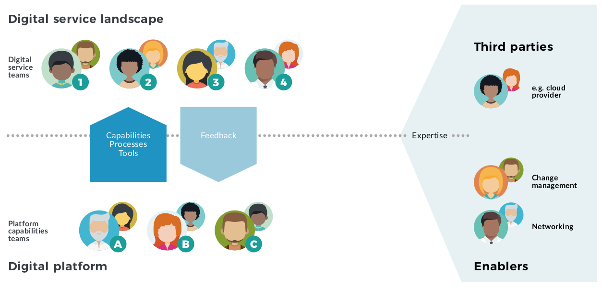

# Overview

The Equal Experts Digital Platform playbook is our thinking on why, when, and how to build Digital Platforms. A Digital Platform enables an organisation to achieve Continuous Delivery and Operability at scale.

Our approach is based on first-hand experience building Digital Platforms, and our deep expertise in both Continuous Delivery and Operability.

We’ve [open-sourced](https://github.com/EqualExperts/digital-platform-playbook) this playbook under a [Creative Commons license](https://creativecommons.org/licenses/by-nc/4.0/), and we encourage [contributions](https://digital-platform.playbook.ee/contribute) to iteratively improve our content.

### The lead authors of this playbook are:

|  |  |
| :--- | :--- |
|   | [Adam Hansrod](https://www.linkedin.com/in/adam-hansrod-22940876/) |
|   | [Steve Smith](https://www.linkedin.com/in/stevesmithtech/)  |
|   | [Alun Coppack](https://www.linkedin.com/in/aluncoppack/)  |
|   | [Edd Grant](https://www.linkedin.com/in/eddgrant/) |
