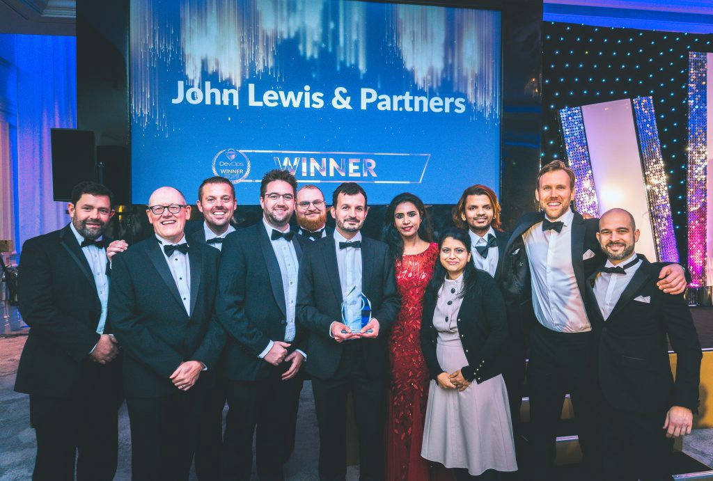

# John Lewis & Partners

Equal Experts has partnered with John Lewis & Partners on the John Lewis & Partners Digital Platform \(JLDP\) since 2017. As of September 2020, JLDP has surpassed 30 teams and 100 microservices. 

## Case Studies



## Videos





## Articles

{% embed url="https://medium.com/john-lewis-software-engineering/a-year-in-google-cloud-4586a117f352"}



