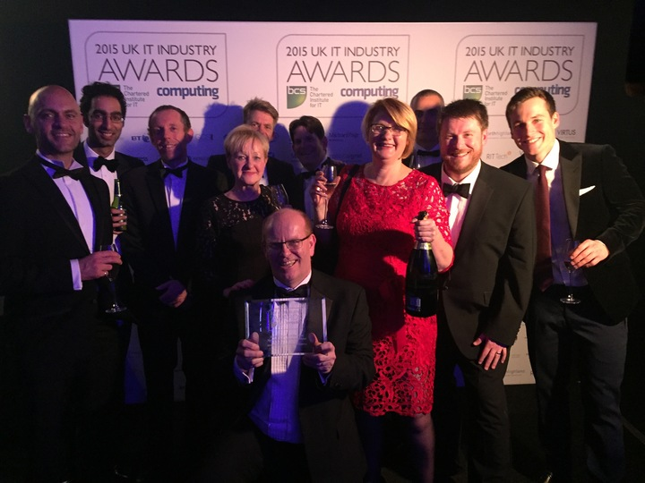

# HMRC

Equal Experts has worked with HMRC on the Multichannel Digital Tax Platform \(MDTP\) for over 6 years. At its peak, MDTP has had over 60 teams and 600 microservices.

## Videos

Antony Collard from HMRC and Lyndsay Prewer from Equal Experts talked about [Making Tax Digital](https://www.youtube.com/watch?v=-gcvUM5VhEk) at DevOps Enterprise Summit 2018.







## Articles

Some articles about HMRC:

* [How Equal Experts Helped HMRC To Get COVID-19 Relief Money To People Through Continuous Delivery](https://www.equalexperts.com/blog/our-thinking/how-equal-experts-helped-hmrc-to-get-covid-19-relief-money-to-people-through-continuous-delivery/) by Lyndsay Prewer from Equal Experts.
* [Operability at HMRC](https://www.equalexperts.com/blog/our-thinking/operability-hmrc/) by Alun Coppack from Equal Experts.

