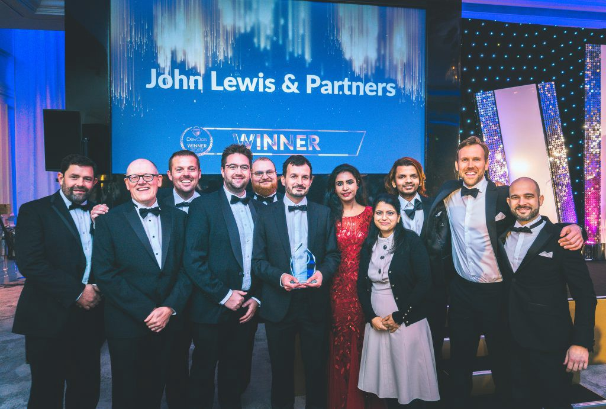

# John Lewis & Partners

Equal Experts has partnered with John Lewis & Partners on the John Lewis & Partners Digital Platform \(JLDP\) since 2017. As of September 2020, JLDP has surpassed 30 teams and 100 microservices. John Lewis & Partners have enthusiastically embraced You Build It You Run It at scale, as described in this playbook.

## Case Studies

* [How to do digital transformation like John Lewis & Partners](https://www.equalexperts.com/case-study/how-to-do-digital-transformation-like-john-lewis-partners/)

## Videos

### Operability and You Build It You Run It at JL&P by Simon Skelton and Steve Smith



### Replatforming online search for a major high street retailer by Sue Clutton and Stephen Tjasink



## Articles

* [Equal Experts engineer chaos at John Lewis & Partners](https://www.equalexperts.com/blog/our-thinking/equal-experts-engineer-chaos-at-john-lewis-partners/) by Lyndsay Prewer from Equal Experts.
* [Our Award Winning John Lewis Digital Platform](https://medium.com/john-lewis-software-engineering/our-award-winning-john-lewis-digital-platform-2d093e03d542) by Rob Hornby from John Lewis & Partners .
* [A Year in Google Cloud](https://medium.com/john-lewis-software-engineering/a-year-in-google-cloud-4586a117f352) by Alex Moss from John Lewis & Partners.