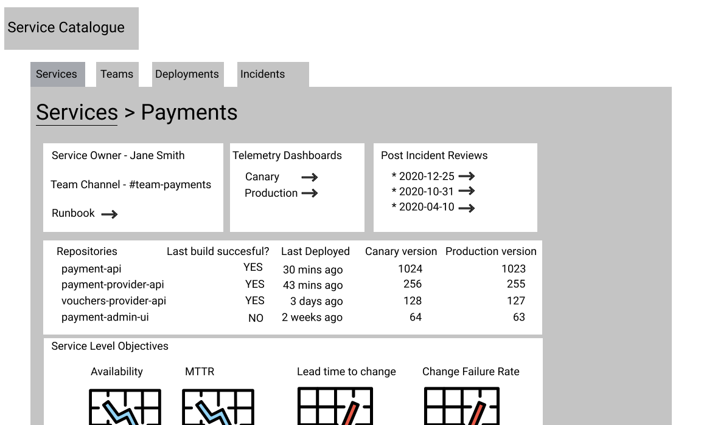

# Capabilities of a Digital Platform

A Digital Platform capability combines people, processes, and/or tools. It's provided by a Digital Platform team, to accelerate Digital Service teams.

A capability such as “Deploy A Service” should be self-service. A Digital Service team must be able to provision, configure, and manage a capability themselves. It’ll encourage your Digital Service teams to be accountable for outcomes associated with their Digital Service. Digital Platform teams can provide sensible defaults out of the box, which Digital Service teams can modify themselves when appropriate.

The most common Digital Platform capabilities and the corresponding features that could be reasonably expected are listed below. This list isn’t exhaustive, and it isn’t prioritised. Your Digital Platform might need more or fewer of these capabilities, to meet the needs of your Digital Service teams.

## Create a team

* Public cloud authentication and authorisation set up.
* Incident email group set up.
* Single sign-on to all tooling for team members.

## Create a service

* Code repositories set up in version control, with default memory settings etc.
* Selected availability target defined in production alerts and monitoring dashboards. 
* Selected deployment target defined in monitoring dashboards.
* Runbook set up in version control, with code repository locations.
* Incident reviews template set up in version control, with team member names and code repository locations.

Reducing the barrier to creating a service \(that is preset with sensible default values\) enables service teams to focus on delivering value for their users rather than working to matching operability parity with the existing services.

## Build a service

* One click provisioning of curated cloud commodities, such as asynchronous messaging and databases.
* Curated build jobs set up, with opinionated defaults such as 5 min timeouts.
* Container vulnerability scanner configured for container image repository.
* Dependency vulnerability scanner configured for code repositories.

## Deploy a service

* Deployment pipeline of curated environments, with a few environments named by intent. 
* Curated deployment jobs setup, with auto-deploy on successful build and auto-rollback on failed deployment health checks.

## Test a service

* Stubbed dependencies and test executors, for automated functional tests.
* Hosted contract testing broker available, or examples of how to setup contract testing in a pipeline
* Predefined load profiles and test executors, for automated load tests.
* Predefined user journeys and test executors, for post-deployment smoke tests.
* Predefined fault injection scenarios and test executors, for Chaos Days and automated chaos testing.

## Launch a service

* Operability assessments, with automated checks and exploratory questions for leading and trailing indicators of operability.
* Automated change requests, and a publicly available read-only audit trail. 
* Blue-Green deployments or Canary Deployments for incremental rollouts.
* Dark Launching via feature toggles for customer A/B testing.
* Automated configuration of on-call rota for team members

## Run a service

* Service compute available, such as container orchestrator or functions runtime.
* Vertical and/or horizontal scaling of compute configured for service.
* Checks on release candidate signatures from container image repository.
* Caching on the wire between services, and before downstream dependencies.
* Circuit breakers on the wire between services, and before downstream dependencies.
* Automated database operations, such as migrate schema and database restore.
* Networking functions, such as edge proxies and DNS resolution.

## Service logging

* Structured logging pipeline from service runtime to logs storage.
* Curated logging dashboards showing service traffic and downstream dependencies.

## Service monitoring

* Metrics pipeline from service runtime to metrics storage.
* Service request tracing
* Curated monitoring dashboards showing the [Four Golden Signals](https://landing.google.com/sre/sre-book/chapters/monitoring-distributed-systems/#xref_monitoring_golden-signals), availability targets, and deployment targets.

Implementing standardised-but-extendable metrics, dashboards, and alerts for all the services on a platform provides several benefits:

* reduce the cost of context switching for service team members when working across multiple services
* greater effiency as not every team has to re-invent the wheel to monitor their service
* teams get a basic level of monitoring for free, and can then be encouraged to further customise their service's dashboards to provide richer information

## Service alerting

* Alerts pipeline from alerts manager to incident response system.
* Curated [Service Level Objective](https://landing.google.com/sre/sre-book/chapters/service-level-objectives/) alerts, such as Request Success Rate based on selected availability target.

## Service analytics

* Analytics pipeline from Digital Service frontends to analytics tooling.
* Curated analytics dashboards, such as demographic breakdowns for customers.

## Service support

* Platform health monitoring and a publicly available platform status page.
* Health monitoring of third-party systems.
* Automated incident creation, team notifications, and response channel creation.
* Consistent post-incident review process including live telemetry data.
* One click amendments to scheduled on-call rota for team members.

Digital Platform Teams aren't the owner of an organisation's incident response process, but they will often have to automate and engineer solutions to help the incident response process achieve better results for their both service team's and their own incidents.

## Services Catalogue

A services catalogue is an information portal, that maximises the discoverability of teams and services on a digital platform. It's powered by machine-readable metadata sourced from version control systems, deployment tools, metrics aggregators, ticketing workflow systems, and machine-readable post-incident reviews. Portal content usually includes:

* List all Digital Services and their owning teams, in a publicly available catalogue.
* List all Digital Platform capabilities and their owning teams.
* List all curated test environments with described intent.
* Dashboard of recent change requests as an audit trail.
* Dashboard of all recent deployments with per-service and per-date filters.
* Dashboard of all recent incidents with per-service and per-change request filters.
* Deployment indicators for Digital Services and their owning teams.
* Digital Service reliability data, showing availability % and time to restore. 

An example of a Services Catalogue is [Spotify's Backstage](https://backstage.io/)

## Admin

* Add new joiner to organisation-wide tools and processes on arrival.
* Add new joiner to team tools and permissions on arrival.
* Remove leaver from team and organisation-wide tools on departure.
* Transfer all service setup from one team to another team.
* Delete a service in its entirety.



I joined the Self Assessment team at HMRC in 2015. In many projects I was involved in beforehand, the developers often didn’t have an opportunity to see their services in use. I find this approach incomplete and unsatisfying. Hence, I was glad when on my first day at HMRC, we reviewed telemetry dashboards as part of our standup.

The telemetry embedded into the Tax Platform didn’t just help us to debug problems in production. Inspecting how our service operated under real load helped me understand Scala in-depth, which was new for me at that time.

Business metrics provided constant feedback on how our changes impact user experience. I believe this contributed to a high sense of ownership in the team.

The ability to customise our telemetry dashboards helped us prepare for the Self Assessment peak in early 2016. Observing the performance of every crucial element of our service under higher load made us confident that our response to a potential failure would be effective.




