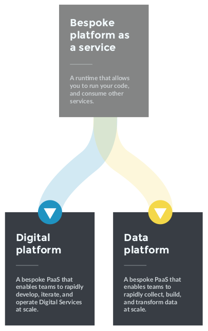

# What is a Bespoke Platform as a Service

A Digital Platform is a type of bespoke platform as a service \(PaaS\), built by a [platform team](https://teamtopologies.com/key-concepts)

> A bespoke PaaS is a set of streamlined tools, processes, and people within your organisation, which form platform capabilities to help your organisation’s teams rapidly meet the needs of your customers.

There are different types of bespoke PaaS, based on workload. The most common types we’ve seen before are Digital and Data Platforms. We advise your organisation invests in a bespoke PaaS when a clear, homogenous workload starts to emerge across multiple teams.

We strongly recommend you host a bespoke PaaS in a single public cloud, using Amazon Web Services \(AWS\), Azure, or Google Cloud Platform \(GCP\). We have deep expertise in all three of those public clouds. Each is an effective foundation for a bespoke PaaS because they offer a tried-and-tested, on-demand, cloud computing platform, with a wide range of reliable cloud services that can be provisioned instantly and billed on a pay-per-use basis.
