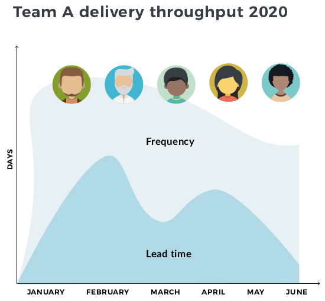

# Bootstrap

### Share a vision

A Digital Platform vision will help people to understand what you intend to accomplish, and create a powerful framing device for future conversations about platform capabilities. 

We recommend a Digital Platform vision be produced in a short [Inception](https://inception.playbook.ee/) phase, prior to any team staffing. This will help you bring together stakeholders and potential users to clarify the problems you’re trying to solve in your organisation. It’s also an opportunity to agree upon early Digital Platform boundaries and responsibilities. You may even find that a Digital Platform will not achieve what your organisation needs.

We’ve worked with clients on a number of Digital Platform visions. One example we wholeheartedly recommend is from [John Lewis & Partners Digital Platform \(JLDP\)](https://medium.com/john-lewis-software-engineering/our-award-winning-john-lewis-digital-platform-2d093e03d542):

> JLDP will empower teams through a frictionless & stable state-of-the-art platform, so that they can quickly deliver innovative & high quality services for our customers.

This clearly communicates the intent behind the John Lewis & Partners Digital Platform – a desire to rapidly innovate in Digital Service and benefit customers via team empowerment, opinionated user journeys, and the use of the latest cloud technologies. 

### Measure for success

All Digital Platform teams and Digital Service teams need to have measures of success on delivery throughput, production reliability, and user satisfaction. We recommend those measures are publicly radiated on an internal website, for all teams and stakeholders to see.

For all teams, delivery throughput can be measured using the [Accelerate](https://www.amazon.com/dp/B07B9F83WM) metrics of Lead Time and Frequency \(i.e. time to deploy a new feature and the rate of deployment of new features\). Production reliability can be measured using Availability % and Time To Restore Availability. Data collection can be automated for all metrics, via the deployment pipeline and alerting toolchain.

These measures can be visualised as information indicators in order to show emerging trends and identify teams in need of assistance. For more on this, see [Measuring Continuous Delivery](https://leanpub.com/measuringcontinuousdelivery) by Steve Smith. Below is an example of a team information indicator for delivery throughput.

Measures of user satisfaction will vary across Digital Platform and Digital Service teams. Digital Platform teams that focus on conversations, surveys, and capability analytics will better understand Digital Service teams’ experiences. Digital Service teams can implement customer satisfaction metrics using Net Promoter Score \(NPS\) and customer journey analytics.

